# udemy-03-java-design-patterns
Udemy - Patrones de Diseño en Java

# 📚 Type of Patterns
- Creational
  - [Factory Method](#-factory-method).
  - [Abstract Factory](#-abstract-factory).
  - [Builder](#-builder).
  - [Prototype](#-prototype).
  - [Singleton](#-singleton).
- Structural
  - [Adapter](#-adapter).
  - [Bridge](#-bridge).
  - Composite.
- Behavioral
  - [Chain of Responsibility](#-chain-of-responsibility).
  - [Command](#-command).
  - [Interpreter](#-interpreter).
  - [Iterator](#-iterator).
  - [Mediator](#-mediator).
  - [Memento](#-memento).
  - [Observer](#-observer).
  - [State](#-state).
  - [Strategy](#-strategy).
  - [Template Method](#-template-method).
  - [Visitor](#-visitor).

# Design Patterns

---
## 🏭 Factory Method

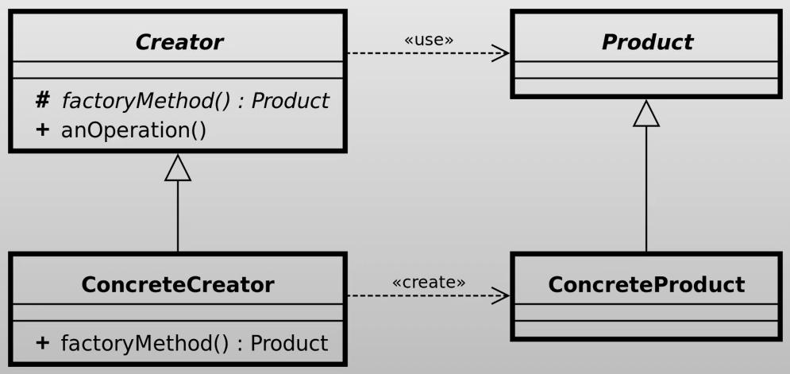

### 📖 Descripción
El patrón **Factory Method** define una interfaz para crear objetos, pero permite que las subclases decidan qué clase instanciar.

### 🎯 Problema que resuelve
- Evitar el uso directo de `new`.
- Desacoplar la creación de objetos.
- Facilitar extensión del código.

### 🧱 Estructura
| Rol | Descripción |
|-----|-------------|
| Product | Interfaz común |
| ConcreteProduct | Implementaciones concretas |
| Creator | Clase base con factory method |
| ConcreteCreator | Implementación concreta |

### 🔎 Cuándo usarlo
- Cuando no sabes qué objeto exacto crear en tiempo de compilación.
- Cuando quieres delegar la creación a subclases.
- Cuando quieres evitar usar `new` directamente.
- Cuando tienes lógica condicional de creación.

#### Ejemplos reales
- Creación de tarjetas de crédito (visa, mastercard, amex).
- Notificaciones (email, sms, push).
- Parsers de archivos (json, xml, csv).
- Conexiones a bases de datos (mysql, mongodb).
- Frameworks.

---
## 🏭 Abstract Factory

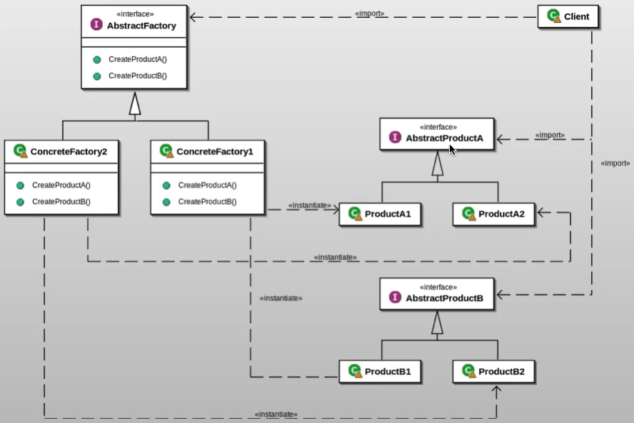

### 📖 Descripción
El patrón **Abstract Factory** proporciona una interfaz para crear **familias de objetos relacionados o dependientes** sin especificar sus clases concretas.

Permite que el cliente trabaje únicamente con interfaces, desacoplando completamente la lógica de creación.

### 🎯 Problema que resuelve
- Evita dependencias directas con clases concretas.
- Garantiza consistencia entre productos de una misma familia.
- Facilita el cambio completo de configuración (por ejemplo, cambiar toda la familia VISA por MASTERCARD).

### 🧱 Estructura
| Rol | Responsabilidad |
|------|----------------|
| AbstractFactory | Declara métodos para crear productos abstractos |
| ConcreteFactory | Implementa la creación de productos concretos |
| AbstractProduct | Interfaz común de los productos |
| ConcreteProduct | Implementaciones específicas |
| Client | Usa solo interfaces |

### 🔎 Cuándo usarlo
- Cuando tienes múltiples de objetos relacionados (familias).
- Cuando necesitas cambiar toda la configuración de una vez.
- Cuando quieres garantizar compatibilidad entre objetos.
- Cuando buscas desacoplar creación de uso.

#### Ejemplos reales
- Sistemas de pagos.
- UI Multiplataforma.
- Drivers de Base de Datos.

---
## 🏗️ Builder

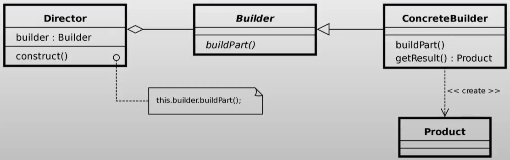

### 📖 Descripción
El patrón **Builder** separa la construcción de un objeto complejo de su representación, permitiendo crear diferentes representaciones usando el mismo proceso de construcción.

Es ideal cuando:
- El objeto tiene muchos atributos opcionales.
- Se quiere evitar constructores con demasiados parámetros.
- Se necesita controlar el proceso de creación paso a paso.

### 🎯 Problema que resuelve
- Evita constructores telescópicos (constructores sobrecargados que se van extendiendo).
- Mejora la legibilidad del código.
- Permite crear distintas configuraciones del mismo objeto.

### 🧱 Estructura
| Rol | Responsabilidad |
|------|----------------|
| Builder | Define los pasos de construcción |
| ConcreteBuilder | Implementa los pasos |
| Director (opcional) | Orquesta el proceso de construcción |
| Product | Objeto final complejo |

### 🔎 Cuándo usarlo
- Cuando se tienen muchos parámetros.
- Cuando el objeto es difícil de construir.
- Cuando se quiere inmutabilidad (campos final).
- Cuando se necesita diferentes configuraciones del mismo objeto.

#### Ejemplos reales
- Requests HTTP.
- Configuración de bases de datos.
- Creación de documentos.
- Órdenes de compra.

---
## 🧬 Prototype

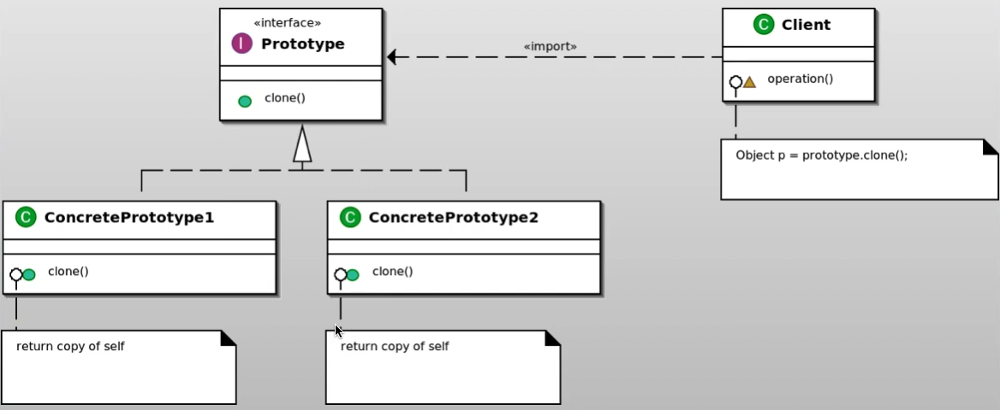

### 📖 Descripción
El patrón **Prototype** permite crear nuevos objetos **clonando una instancia existente**, en lugar de crear un objeto desde cero.

Esto es útil cuando la creación de objetos es **costosa o compleja**, y es más eficiente copiar una instancia ya configurada.

### 🎯 Problema que resuelve
- Evita la creación repetitiva de objetos complejos.
- Reduce el costo de inicialización.
- Permite crear copias de objetos en tiempo de ejecución.

### 🧱 Estructura
| Rol | Responsabilidad                                    |
|------|----------------------------------------------------|
| Prototype | Interfaz que define el método `clone()` o `copy()` |
| ConcretePrototype | Implementa la clonación                            |
| Client | Clona el objeto existente                          |

### 🔎 Cuándo usarlo
- Cuando crear un objeto es costoso.
- Cuando necesitas muchas instancias similares.
- Cuando quieres evitar dependencias con constructores complejos.

#### Ejemplos reales
- Editores gráficos.
- Juegos de cartas.
- Videojuegos.
- Plantillas de documentos.
- Requests HTTP.
- Testing BD.

---
## 🔒 Singleton

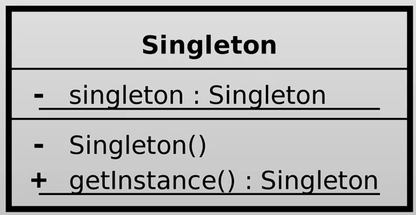

### 📖 Descripción

El patrón **Singleton** asegura que una clase tenga **solo una instancia** durante toda la ejecución de la aplicación y ofrece un punto global para acceder a ella.

Se utiliza comúnmente para objetos que deben ser **compartidos en toda la aplicación**, como configuraciones, conexiones o administradores de recursos.

### 🎯 Problema que resuelve

- Evita crear múltiples instancias innecesarias.
- Controla el acceso global a un objeto.
- Centraliza la gestión de recursos compartidos.

### 🧱 Estructura
| Rol | Responsabilidad |
|-----|----------------|
| Singleton | Clase que controla la creación de su única instancia |
| Instance | Instancia única accesible globalmente |
| Client | Obtiene la instancia mediante un método estático |

### 🔎 Cuándo usarlo
- Cuando hay una única instancia en toda la aplicación.
- Cuando hay un punto de acceso global controlado.

#### Ejemplos reales
- Configuraciones globales.
- Conexión a recursos compartidos.
- Caché en memoria.
- Pool de conexiones.
- Logger.

---
## ⛓️ Chain of Responsibility

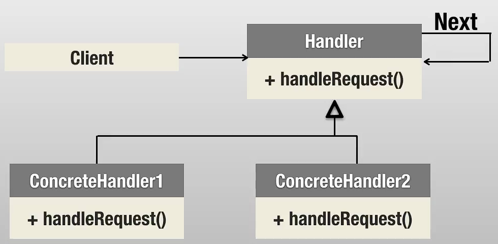

### 📖 Descripción

El patrón **Chain of Responsibility** evita acoplar el emisor de una solicitud con su receptor, dando a varios objetos la oportunidad de manejarla.

Los objetos se organizan en una **cadena**, y cada uno decide si puede procesar la solicitud o pasarla al siguiente.

### 🎯 Problema que resuelve

- Elimina dependencias rígidas entre quien envía y quien procesa la solicitud.
- Permite agregar o quitar manejadores fácilmente.
- Facilita construir pipelines de procesamiento.

### 🧱 Estructura

| Rol | Responsabilidad |
|-----|----------------|
| Handler | Define la interfaz para manejar solicitudes |
| ConcreteHandler | Procesa la solicitud o la pasa al siguiente |
| Client | Inicia la solicitud en la cadena |

### 🔎 Cuándo usarlo
- Cuando varios objetos pueden manejar una solicitud.
- Cuando no se sabe de antemano quién debe procesarla.
- Cuando quieres construir pipelines de procesamiento.

#### Ejemplos reales
- Middleware de autenticación.
- Filtros HTTP.
- Validaciones en cascada.
- Procesamiento de logs.

---
## 🎮 Command

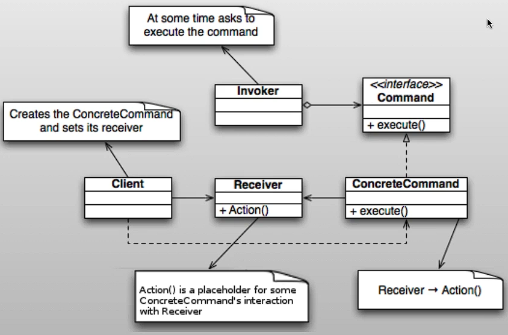

### 📖 Descripción

El patrón **Command** convierte una solicitud en un objeto independiente que contiene toda la información necesaria para ejecutarla.

Esto permite:
- Desacoplar quien envía la solicitud de quien la ejecuta.
- Soportar operaciones como **undo/redo**.
- Manejar colas de comandos.

### 🎯 Problema que resuelve

- Elimina el acoplamiento entre emisor y receptor.
- Permite registrar y deshacer operaciones.
- Facilita la implementación de macros o acciones compuestas.

### 🧱 Estructura

| Rol | Responsabilidad |
|-----|----------------|
| Command | Declara la interfaz (`execute`) |
| ConcreteCommand | Implementa la ejecución |
| Receiver | Realiza la acción real |
| Invoker | Llama al comando |
| Client | Configura los comandos |

### 🔎 Cuándo usarlo
- Botones de UI (acciones desacopladas).
- Sistemas con undo/redo.
- Colas de tareas.
- Logs de operaciones.

#### Ejemplo real
- Un control remoto donde cada botón es un comando.

---
## 🧠 Interpreter

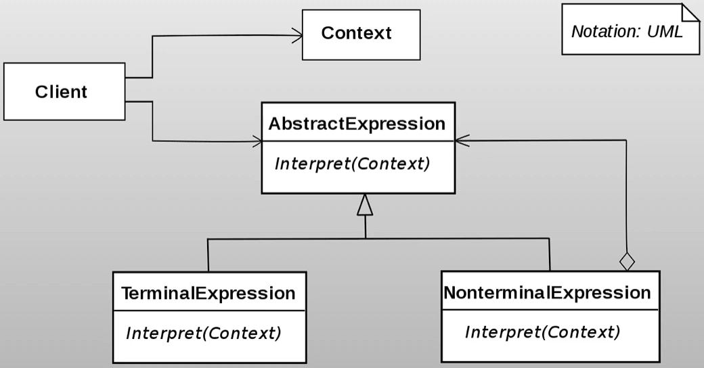

### 📖 Descripción

El patrón **Interpreter** se utiliza para definir una gramática y evaluar expresiones de un lenguaje específico.

Convierte expresiones en estructuras (normalmente árboles) donde cada nodo sabe cómo interpretarse.

### 🎯 Problema que resuelve

- Permite evaluar expresiones complejas de forma estructurada.
- Facilita la creación de mini-lenguajes o reglas.
- Evita lógica condicional compleja para parsing.

### 🧱 Estructura

| Rol | Responsabilidad |
|-----|----------------|
| Expression | Interfaz para interpretar |
| TerminalExpression | Elementos básicos del lenguaje |
| NonTerminalExpression | Combinación de expresiones |
| Context | Contiene información a interpretar |
| Client | Construye y evalúa la expresión |

### 🔎 Cuándo usar Interpreter
- Cuando tienes un lenguaje simple que necesitas interpretar.
- Cuando necesitas evaluar reglas dinámicas.
- Cuando quieres representar expresiones como estructuras (árboles).

#### Ejemplos reales
- Motores de reglas (rule engines).
- Filtros de búsqueda.
- Expresiones booleanas (AND, OR, NOT).
- Parsers simples.

---
## 🔁 Iterator

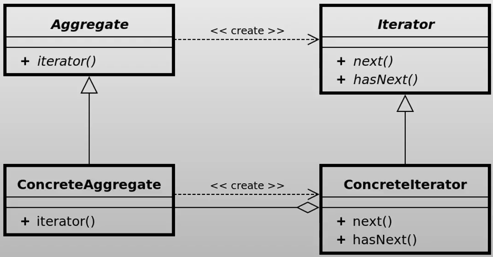

### 📖 Descripción

El patrón **Iterator** permite acceder secuencialmente a los elementos de una colección sin revelar cómo están almacenados internamente.

Separa la lógica de recorrido de la estructura de datos, facilitando cambios en la colección sin afectar al cliente.

### 🎯 Problema que resuelve

- Evita exponer la estructura interna de una colección.
- Permite múltiples formas de recorrido.
- Desacopla la iteración de la colección.

### 🧱 Estructura

| Rol | Responsabilidad |
|-----|----------------|
| Iterator | Define operaciones (`hasNext`, `next`) |
| ConcreteIterator | Implementa el recorrido |
| Aggregate | Define método para crear iterador |
| ConcreteAggregate | Implementa la colección |
| Client | Usa el iterador |

### 🔎 Cuándo usarlo
- Cuando quieres recorrer una colección sin exponer su implementación.
- Cuando necesitas múltiples formas de iteración.
- Cuando quieres unificar el acceso a diferentes estructuras de datos.

#### Ejemplos reales
- Colecciones en Java (List, Set).
- Streams.
- Navegación en árboles o grafos.

---
## 🤝 Mediator

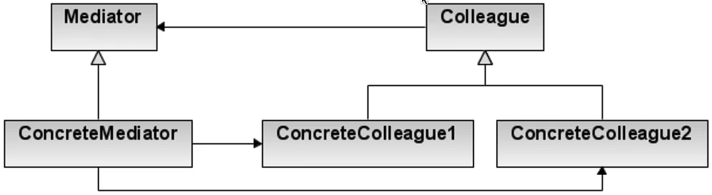

### 📖 Descripción

El patrón **Mediator** define un objeto que encapsula cómo interactúan un conjunto de objetos.

En lugar de que los objetos se comuniquen directamente entre sí, lo hacen a través de un **mediador**, lo que reduce las dependencias y mejora la mantenibilidad.

### 🎯 Problema que resuelve

- Evita dependencias complejas entre múltiples objetos.
- Reduce el acoplamiento (muchos a muchos → uno a muchos).
- Centraliza la lógica de comunicación.

### 🧱 Estructura

| Rol | Responsabilidad |
|-----|----------------|
| Mediator | Define la interfaz de comunicación |
| ConcreteMediator | Implementa la coordinación |
| Colleague | Clase que se comunica mediante el mediador |
| ConcreteColleague | Implementación específica |

### 🔎 Cuándo usarlo
- Cuando muchos objetos interactúan entre sí.
- Cuando la lógica de comunicación está distribuida y se vuelve difícil de mantener.
- Cuando quieres centralizar reglas de interacción.

#### Ejemplos reales
- Chats (usuarios → mediador).
- Controladores de UI.
- Sistemas de eventos.

---
## 🧠 Memento

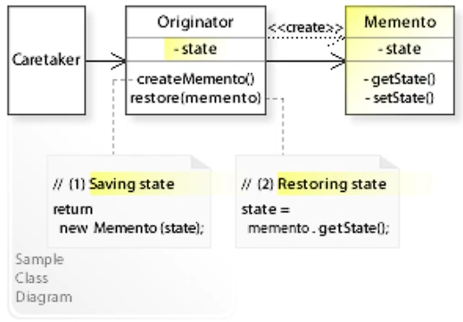

### 📖 Descripción

El patrón **Memento** permite guardar el estado de un objeto en un momento determinado y restaurarlo posteriormente, sin exponer sus detalles internos.

Se utiliza comúnmente para implementar funcionalidades como **undo/redo**.

### 🎯 Problema que resuelve

- Permite guardar y restaurar estados sin romper encapsulamiento.
- Facilita implementar historial de cambios.
- Evita exponer atributos internos del objeto.

### 🧱 Estructura

| Rol | Responsabilidad |
|-----|----------------|
| Originator | Objeto cuyo estado se guarda |
| Memento | Contiene el estado guardado |
| Caretaker | Gestiona los mementos (historial) |

### 🔎 Cuándo usarlo
- Cuando necesitas implementar undo/redo.
- Cuando quieres guardar snapshots de estado.
- Cuando necesitas restaurar objetos sin exponer su estructura interna.

#### Ejemplos reales
- Editores de texto.
- Juegos (guardar partida).
- Sistemas de historial.

---
## 📡 Observer

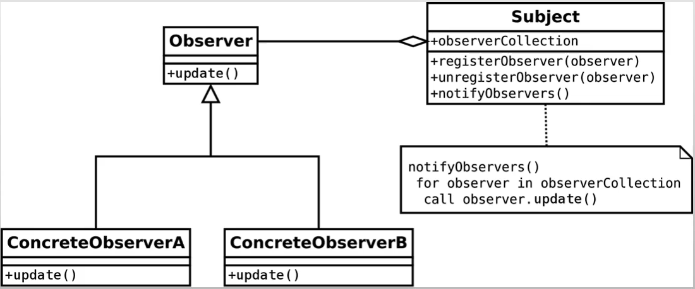

### 📖 Descripción

El patrón **Observer** establece un mecanismo de suscripción donde múltiples objetos (**observers**) escuchan cambios en otro objeto (**subject**).

Cuando el estado del sujeto cambia, todos los observadores son notificados automáticamente.

### 🎯 Problema que resuelve

- Permite comunicación desacoplada entre objetos.
- Facilita la implementación de sistemas reactivos.
- Evita polling constante (consultas repetidas).

### 🧱 Estructura

| Rol | Responsabilidad |
|-----|----------------|
| Subject | Mantiene lista de observadores |
| Observer | Define método de actualización |
| ConcreteSubject | Notifica cambios |
| ConcreteObserver | Reacciona a cambios |

### 🔎 Cuándo usarlo
- Cuando múltiples objetos deben reaccionar a cambios.
- Cuando quieres desacoplar productores y consumidores de eventos.
- Cuando implementas sistemas basados en eventos.

#### Ejemplos reales
- Notificaciones (email, push).
- Interfaces gráficas (event listeners).
- Sistemas de eventos.

---
## 🔄 State

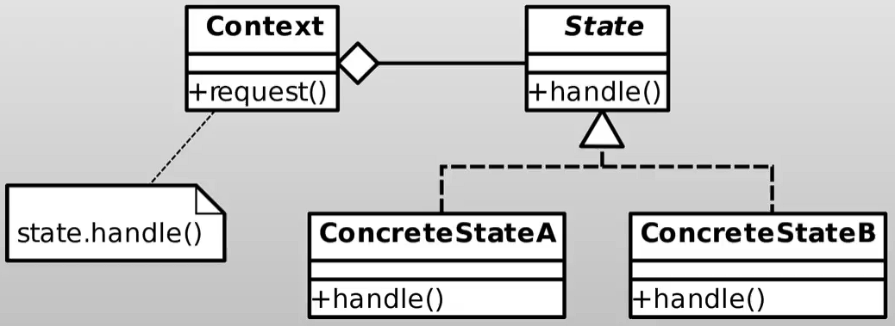

### 📖 Descripción

El patrón **State** permite que un objeto altere su comportamiento cuando su estado interno cambia, como si cambiara de clase.

En lugar de usar múltiples condicionales (`if` / `switch`), el comportamiento se delega a objetos que representan cada estado.

### 🎯 Problema que resuelve

- Elimina grandes bloques de condicionales.
- Facilita agregar nuevos estados sin modificar el código existente.
- Mejora la mantenibilidad y escalabilidad.

### 🔎 Cuándo usarlo
- Cuando un objeto cambia su comportamiento según su estado.
- Cuando hay muchos if o switch basados en estado.
- Cuando quieres modelar transiciones de estados claramente.

#### Ejemplos reales
- Estados de una orden (CREATED → PAID → SHIPPED).
- Estados de una conexión (OPEN → CLOSED).
- Flujo de una máquina de estados.

---
## 🎯 Strategy

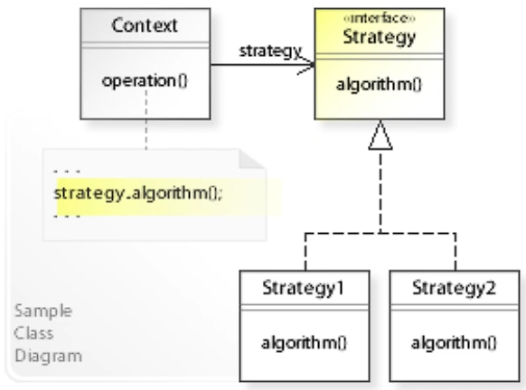

### 📖 Descripción

El patrón **Strategy** permite definir múltiples algoritmos o comportamientos y seleccionar cuál usar en tiempo de ejecución.

En lugar de usar múltiples `if` o `switch`, cada comportamiento se encapsula en una clase independiente.

### 🎯 Problema que resuelve

- Elimina condicionales complejos.
- Permite cambiar comportamiento dinámicamente.
- Facilita agregar nuevos algoritmos sin modificar código existente.

### 🧱 Estructura

| Rol | Responsabilidad |
|-----|----------------|
| Strategy | Define la interfaz del algoritmo |
| ConcreteStrategy | Implementa el algoritmo |
| Context | Usa una estrategia |
| Client | Selecciona la estrategia |

### 🔎 Cuándo usarlo
- Cuando tienes múltiples formas de realizar una operación.
- Cuando quieres cambiar comportamiento en runtime.
- Cuando quieres evitar condicionales extensos.

#### Ejemplos reales
- Métodos de pago (tarjeta, PayPal, efectivo).
- Algoritmos de ordenamiento.
- Estrategias de envío (rápido, estándar).
- Compresión de archivos.

---
## 🧩 Template Method

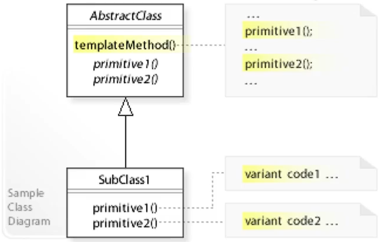

### 📖 Descripción

El patrón **Template Method** define una secuencia de pasos para ejecutar un algoritmo, donde algunos pasos pueden ser implementados o sobrescritos por las subclases.

Esto permite reutilizar la estructura general mientras se personalizan partes específicas del comportamiento.

### 🎯 Problema que resuelve

- Evita duplicación de código.
- Define una estructura clara para algoritmos.
- Permite variaciones en pasos específicos sin alterar el flujo general.

### 🧱 Estructura

| Rol | Responsabilidad |
|-----|----------------|
| AbstractClass | Define el template method (algoritmo) |
| ConcreteClass | Implementa pasos específicos |
| Template Method | Define el flujo del algoritmo |
| Hook (opcional) | Permite extensiones opcionales |

### 🔎 Cuándo usarlo
- Cuando varios algoritmos comparten la misma estructura.
- Cuando quieres evitar duplicación de lógica.
- Cuando necesitas definir un flujo fijo con pasos personalizables.

#### Ejemplos reales
- Procesamiento de pagos (VISA, MasterCard).
- Flujos de autenticación.
- Procesamiento de archivos.
- Frameworks que definen ciclos de vida.

---
## 🧭 Visitor

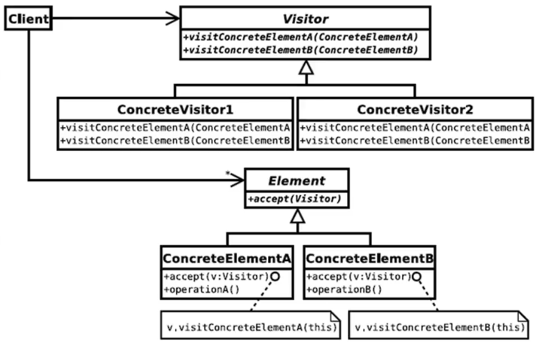

### 📖 Descripción

El patrón **Visitor** separa los algoritmos de la estructura de objetos sobre la que operan.

Permite definir nuevas operaciones sin cambiar las clases de los elementos, delegando la lógica a un objeto visitante.

### 🎯 Problema que resuelve

- Evita modificar clases existentes al agregar nuevas funcionalidades.
- Permite agrupar operaciones relacionadas.
- Facilita aplicar múltiples operaciones sobre una estructura de objetos.

### 🧱 Estructura

| Rol | Responsabilidad |
|-----|----------------|
| Visitor | Declara operaciones para cada tipo de elemento |
| ConcreteVisitor | Implementa operaciones específicas |
| Element | Define método `accept(visitor)` |
| ConcreteElement | Implementa aceptación del visitante |
| Client | Aplica el visitante |

### 🔎 Cuándo usarlo
- Cuando necesitas agregar nuevas operaciones frecuentemente.
- Cuando tienes una estructura de objetos estable.
- Cuando quieres separar lógica de negocio de los objetos.

#### Ejemplos reales
- Cálculo de precios/impuestos.
- Exportación de datos (XML, JSON, PDF).
- Validaciones sobre estructuras complejas.
- Compiladores (AST traversal).

---
## 🔌 Adapter

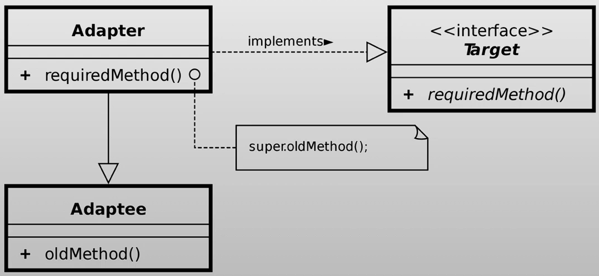

### 📖 Descripción

El patrón **Adapter** actúa como un puente entre dos interfaces incompatibles.

Convierte la interfaz de una clase existente (**Adaptee**) en otra que el cliente espera (**Target**), permitiendo su uso sin modificar el código original.

### 🎯 Problema que resuelve

- Integra clases existentes con interfaces incompatibles.
- Evita modificar código legado.
- Permite reutilizar componentes existentes.

### 🧱 Estructura

| Rol | Responsabilidad |
|-----|----------------|
| Target | Interfaz esperada por el cliente |
| Adaptee | Clase existente con interfaz incompatible |
| Adapter | Convierte la interfaz del Adaptee |
| Client | Usa la interfaz Target |

#### 🔎 Cuándo usarlo
- Cuando necesitas integrar código legado.
- Cuando dos interfaces no son compatibles.
- Cuando quieres reutilizar una clase existente sin modificarla.

#### Ejemplos reales
- Integración de APIs externas (librerías).
- Conectar sistemas legacy.
- Adaptadores de bases de datos.
- Conectores de hardware (USB → HDMI).
- Wrappers de librerías.

---
## 🌉 Bridge

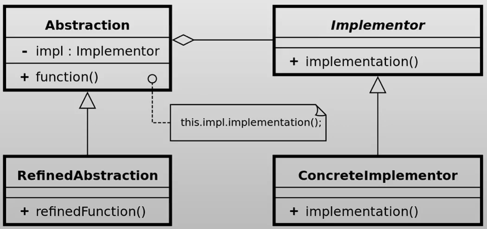

### 📖 Descripción

El patrón **Bridge** desacopla una abstracción de su implementación, permitiendo que ambas evolucionen independientemente.

En lugar de usar herencia para combinar múltiples variantes, se usa **composición**, evitando la explosión de clases.

### 🎯 Problema que resuelve

- Evita combinaciones excesivas de clases (explosión de clases).
- Permite cambiar implementaciones sin afectar al cliente.
- Facilita la extensibilidad.

### 🧱 Estructura

| Rol | Responsabilidad |
|-----|----------------|
| Abstraction | Define la interfaz de alto nivel |
| RefinedAbstraction | Extiende la abstracción |
| Implementor | Define la interfaz de implementación |
| ConcreteImplementor | Implementa la lógica concreta |

### 🔎 Cuándo usarlo
- Cuando tienes dos dimensiones que pueden variar independientemente.
- Cuando quieres evitar una explosión de clases por combinaciones.
- Cuando necesitas cambiar implementaciones en runtime.

#### Ejemplos reales
- Sistemas de pago (tipo de pago + método).
- UI (tipo de componente + tema).
- Dispositivos (control remoto + dispositivo).

---
